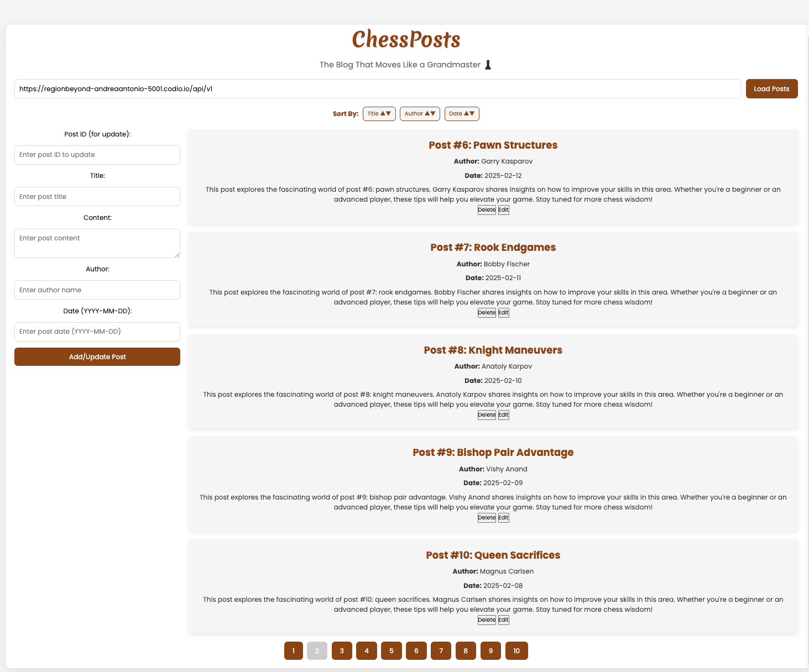
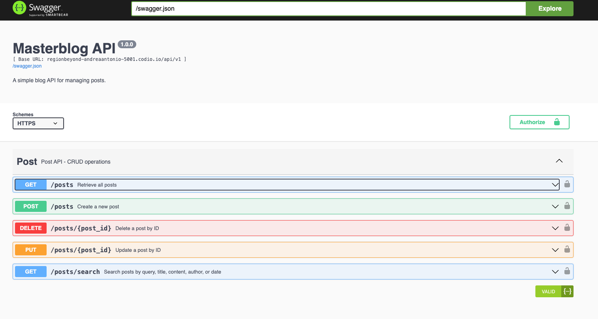

# Masterblog API

A full-stack chess blog application with a Flask RESTful API backend and an interactive JavaScript frontend. Features include post management, pagination, sorting, and Swagger documentation.

## App Interface


## Endpoints Swagger UI



## 🌟 Features

### Backend
- RESTful API endpoints for CRUD operations on blog posts
- API key authentication for secure access
- Rate limiting to prevent abuse
- Swagger UI documentation
- Pagination and sorting capabilities
- Advanced search functionality
- CORS support
- JSON-based data persistence
- Input validation using Marshmallow schemas

### Frontend
- Dynamic post loading with pagination
- Interactive post management (Create, Read, Update, Delete)
- Sortable posts by various fields
- Clean and responsive post display
- Form validation for post creation/editing
- Real-time updates after modifications
- Configurable API base URL

## 🛠️ Technology Stack

Backend:
- Python
- Flask
- Flask-CORS
- Flask-Limiter
- Flask-Swagger-UI
- Marshmallow

Frontend:
- HTML5
- JavaScript (Vanilla)
- CSS3

## 📝 API Endpoints

### Posts

- `GET /api/v1/posts` - Retrieve paginated list of posts
- `GET /api/v1/posts/<id>` - Get specific post by ID
- `POST /api/v1/posts` - Create new post
- `PUT /api/v1/posts/<id>` - Update existing post
- `DELETE /api/v1/posts/<id>` - Delete post
- `GET /api/v1/posts/search` - Search posts

### Documentation

- `GET /api/docs` - Swagger UI documentation
- `GET /swagger.json` - Swagger specification

## 🚀 Getting Started

### Prerequisites

- Python 3.x
- pip
- Web browser with JavaScript enabled

### Installation

1. Clone the repository:
```bash
git clone https://github.com/kaiser-data/Masterblog-API.git
cd Masterblog-API
```

2. Install backend dependencies:
```bash
pip install -r requirements.txt
```

3. Configure environment variables:
```bash
cp .env.example .env
# Edit .env with your settings
```

4. Run the application:
```bash
python app.py
```

5. Open `frontend/index.html` in your web browser

The API will be available at `http://localhost:5001`

## 🔒 Authentication

API requests require an API key to be included either:
- In the request header: `X-API-Key: your-api-key`
- As a query parameter: `?api_key=your-api-key`

## 💻 Frontend Features

### Post Management
```javascript
// Create/Update a post
function addOrUpdatePost() {
    // Validates and submits post data
    // Supports both creation and updates
}

// Delete a post
function deletePost(postId) {
    // Removes post and refreshes display
}
```

### Pagination
```javascript
// Load posts with pagination
function loadPosts(page) {
    // Fetches posts for specified page
    // Updates pagination controls
}
```

### Sorting
```javascript
// Toggle sort direction
function toggleSort(field) {
    // Sorts posts by specified field
    // Toggles between ascending and descending
}
```

## 📖 API Usage Examples

### Create a Post
```bash
curl -X POST http://localhost:5001/api/v1/posts \
  -H "X-API-Key: your-api-key" \
  -H "Content-Type: application/json" \
  -d '{
    "title": "Opening Strategies",
    "content": "The Sicilian Defense is a popular opening...",
    "author": "Magnus Carlsen",
    "date": "2025-02-18"
  }'
```

### Get Posts with Pagination
```bash
curl "http://localhost:5001/api/v1/posts?page=1&per_page=5&sort=date&direction=desc" \
  -H "X-API-Key: your-api-key"
```

### Search Posts
```bash
curl "http://localhost:5001/api/v1/posts/search?query=sicilian&author=magnus" \
  -H "X-API-Key: your-api-key"
```

## ⚙️ Configuration

### Backend Configuration
The application can be configured through environment variables:

- `DEBUG`: Enable debug mode (default: False)
- `API_KEY`: Authentication key for API access
- `RATE_LIMITS`: Rate limiting rules (default: "10 per minute")
- `STORAGE_FILE`: Path to JSON storage file

### Frontend Configuration
Configure the API base URL in your HTML:
```html
<input type="hidden" id="api-base-url" value="http://localhost:5001/api/v1">
```

## 📊 Rate Limiting

- Default rate limit: 10 requests per minute per IP address
- Applies to all API endpoints
- Returns 429 Too Many Requests when limit is exceeded

## 🔍 Search Capabilities

Search posts using multiple criteria:
- General query across all fields
- Specific field search (title, content, author, date)
- Case-insensitive matching
- Partial word matching

## 🤝 Contributing

1. Fork the repository
2. Create your feature branch (`git checkout -b feature/AmazingFeature`)
3. Commit your changes (`git commit -m 'Add some AmazingFeature'`)
4. Push to the branch (`git push origin feature/AmazingFeature`)
5. Open a Pull Request

## 📝 License

This project is licensed under the MIT License - see the LICENSE file for details.